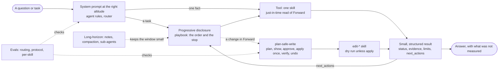

# How Forward Skills gives an AI the right context, in the right amount

Forward Skills does not invent a framework for this. It applies the techniques in Anthropic's
[Effective context engineering for AI agents](https://www.anthropic.com/engineering/effective-context-engineering-for-ai-agents), whose problem
statement is *context rot* (recall degrades as the window fills) and a finite *attention budget*: put the smallest set of high-signal tokens in
front of the model, and let it fetch the rest when it needs it. This page follows that article's headings and says what we do under each.

## The pieces

| Piece | What it is | Runs? | Example |
|---|---|---|---|
| **Skill** | One question over Forward, in Go, returning an evidence envelope: a *tool* in the article's sense | yes | `investigate-reachability`, `inspect-vulnerabilities` |
| **Edit skill** | A skill that changes Forward's own data (never a device); dry run unless `apply: true`, with an exact undo | yes | `edit-device-tags`, `edit-nqe-query` |
| **Playbook** | A procedure: which skills to call for a task, in what order, when to stop, how to answer | no (read it) | `plan-troubleshoot-connectivity`, `plan-security-posture` |
| **Router** | `plan-investigation`: symptom to skill, task to playbook, and what Forward cannot answer | no (read it) | |
| **Protocol** | `plan-safe-write`: plan, show, approval, apply once, verify, undo | no (read it) | |

Names follow one verb rule: `inspect-` reads a fact, `investigate-` diagnoses a cause, `check-`/`verify-` judge against a criterion, `compare-` diffs,
`find-` searches, `review-`/`author-` guide, `plan-` is a procedure, `edit-` writes. A test enforces it.

## The anatomy of effective context

### System prompts at the right altitude
*Specific enough to guide behaviour, flexible enough to give strong heuristics.* The agent rules (`fwdctl docs agents`, written into `AGENTS.md` by `fwdctl install agents`)
are five short rules, not a script: start with a playbook for a task, read the result (unknown is never a pass; read `limits`), never improvise a write, recommend and never
reconfigure, keep the context small. The router (`plan-investigation`) adds the "investigate like an engineer" heuristics and says what Forward cannot answer.

The rules and the router:
- **Router:** `plan-investigation` (symptom to skill, task to playbook, what is out of scope)
- **Writes:** `plan-safe-write` (plan, show, approval, apply once, verify, undo)

### Tools: understood by the model, with minimal overlap
Every skill is one question with one result shape, and its description says what it does and "Use when ...". Overlapping skills were merged behind aliases (retired names still work),
the verb rule keeps names predictable, and the routing eval's "rival" pairs measure the overlap that remains.

The skills, by area:
- **Path analysis and troubleshooting:** `investigate-reachability`, `inspect-topology`, `inspect-history`, `compare-device-config`, `inspect-device-files`, `investigate-collection-failure`
- **Security:** `inspect-vulnerabilities`, `check-network-compliance`
- **Change:** `verify-change`
- **Health and collection:** `inspect-snapshots`, `inspect-collection`, `inspect-performance`, `inspect-environment`
- **Inventory:** `inspect-networks`, `inspect-inventory`
- **NQE:** `find-nqe-query`, `author-nqe-query`, `validate-nqe-query`, `compare-nqe-results`
- **Edit (write, dry run first):** `edit-snapshot-note`, `edit-snapshot-reprocess`, `edit-advanced-reachability`, `edit-checks`, `edit-change-set`, `edit-collection`, `edit-endpoint-profile`, `edit-workspace`, `edit-nqe-query`, `edit-device-tags`, `edit-link-overrides`, `edit-synthetic-query`, `edit-wan-circuit`

The result every tool returns is small and structured, so the model spends its attention on the answer:
- `status`: `ok`, `failed`, `unknown` (could not decide: never a pass) or `error`
- `finding`: one sentence
- `confidence`: `deterministic`, `inferred` or `unknown`
- `evidence`: what the answer rests on, each item with the snapshot and operation it came from
- `limits`: what was not measured, truncated or unavailable
- `context`: which network and snapshot, and how old
- `next_actions`: the skill or playbook that usually follows (a failed result names its owning playbook; a dry run names `plan-safe-write`)
- for an edit skill also `mode` (`dry_run` or `applied`) and `changes` (each with `before`, `after`, `reversible` and `undo`)

### Examples: diverse and canonical
The key playbooks carry a worked example (`reference/example.md`: `plan-troubleshoot-connectivity`, `plan-incident-triage`, `plan-what-changed`, `plan-security-posture`, `plan-vulnerability-response`, `plan-safe-write`),
and every skill has evaluation cases with queries that should and should not trigger it.

## Context retrieval and agentic search

### Just-in-time retrieval
A skill reads Forward when asked and returns a bounded, paged result with `limits` saying what was cut. The model never holds the network, only the answer. NQE gives a custom
question a precise read instead of a dump.

### Progressive disclosure
Context is discovered step by step, so it is never loaded in one go:
1. **The description** of each skill is always in context (the "Use when ..." line). It is the only thing an agent loads for skills it does not use.
2. **The body** loads when the description triggers: `fwdctl describe <skill>`, the plugins, or `forward_skill_guide` in the Copilot.
3. **Reference files** (`reference/*.md`, the worked examples) load only when needed.
4. **The router and the playbooks** are themselves progressive: `plan-investigation` maps a question to one skill or one playbook, and the playbook says which skills to load, in order.
5. **Tools load on demand too:** the Copilot carries a small core set plus `find_skill`, which activates the rest mid-run; `fwdctl which "<question>"` picks without loading anything.

The playbooks, which carry the order of a task:
- **Troubleshooting:** `plan-troubleshoot-connectivity`, `plan-incident-triage`, `plan-snapshot-recovery`, `plan-link-overrides`, `plan-what-changed`, `plan-synthetic-device`
- **Security:** `plan-security-posture`, `plan-vulnerability-response`, `plan-segmentation-check`
- **Audit:** `plan-compliance-audit`, `plan-device-audit`
- **Change:** `plan-change-review`, `plan-maintenance-window`
- **Health:** `plan-health-check`
- **Authoring:** `author-nqe-query`

How each consumer gets all this:

| Consumer | What it gets |
|---|---|
| Claude Code | the plugin (each skill loads by its description; the NQE language server too), or `fwdctl install claude` |
| Codex | the Codex plugin, or the rules and tables in `AGENTS.md` (`fwdctl install agents`) |
| Any agent that runs a shell | `fwdctl docs agents` (the rules), `fwdctl which "<question>"` (an offline first guess from the router), `fwdctl describe <skill>` |
| Skyforge Copilot | a small core set plus `find_skill`; each write skill as a `_plan` tool that cannot write and an act tool behind an approval gate; `forward_skill_guide` reads any skill or playbook |
| Slack, MCP | every skill as a tool, with the same plan and act split |

## Context engineering for long-horizon tasks

| Technique | What Forward Skills does |
|---|---|
| **Compaction** (summarise, restart with the summary) | Each playbook ends in an "Answering" step that says what to keep: the conclusion, the snapshot and the evidence it rests on. The agent rules ask for one line per result instead of carrying the raw evidence. |
| **Structured note-taking** (notes outside the window) | The result envelope is already structured notes (`finding`, `context`, `limits`, `next_actions`). The rules ask for a short running findings list. Persisting it between sessions is the harness's job (memory); a skill has none. |
| **Sub-agent architectures** (focused tasks, clean windows) | The rules and the router ask a harness that can delegate to give each independent branch (one device, one flow, one CVE) to a sub-agent that returns only its conclusion with the snapshot and evidence. Forward Skills calls no model, so this is guidance, not code. |

Not built: no skill stores notes across sessions and none spawns sub-agents; the protocol evaluation does not yet measure whether an agent follows the compaction and sub-agent guidance.

## Checking that it works

Anthropic's skill guidance asks for evaluations; ours are:
- `evals/skills/<skill>.json`: queries that should and should not trigger each skill, with the behaviours a correct run shows (every skill and playbook has one; `go test` requires it)
- `evals/routing.json`: 56 queries with the skill that should answer each and the skill most likely to be confused with it; `skill-eval --routing` scores it with a model (latest: 51 of 56 first skill, 54 of 56 counting the protocol read for edit skills)
- `evals/protocol.json`: write requests; `skill-eval --protocol` checks the agent plans, never applies on its own and asks for approval (applies are refused by a shim, so a failure cannot write)
- `skills/structure_test.go`: the router, playbooks, write protocol and READMEs agree with the registry

## How a question flows

*"Why can't 10.1.1.5 reach the database on 5432?"*

1. The agent's rules and the skill descriptions are in context; the router names `plan-troubleshoot-connectivity` (or the agent asks `fwdctl which "..."`).
2. It reads the playbook (progressive disclosure) and follows its steps: is the snapshot current (`inspect-snapshots`), pin down the flow, `investigate-reachability`, explain the failing hop with `inspect-topology` and `inspect-device-files`, ask `plan-what-changed` whether it is new.
3. Each result is small and says what it measured and what it did not; the agent keeps one line per result.
4. The answer names the first failing device and reason in Forward's words, the snapshot, and what is not modelled.
5. If the fix is a Forward-side change (a tag, a link override, a saved query), `plan-safe-write` governs it: plan, show the exact change and its undo, wait for approval, apply once, verify. A device is never reconfigured: the skills recommend, a person acts.

## Adding a skill

Write it (Go runner, `SKILL.md`, `schema.json`), route it (a row in `plan-investigation`, a step in a playbook if it belongs to a task), list it in both READMEs, add its
evaluations and some confusable cases to `evals/routing.json`. `go test ./skills` fails until each of those is done.
