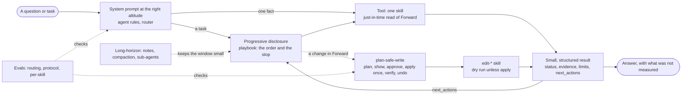

# The skills

The skills are grouped by what Forward does. A **playbook** (procedure) says which skills to call for a task and in what order; a **read skill** answers one question; an **edit skill** changes Forward's own data.

## Index (A to Z)

Every skill, whatever its area. Start with `plan-investigation`, or run `fwdctl which "<question>"` to be routed.

<!-- skill-index:begin (generated: UPDATE_SKILL_INDEX=1 go test ./skills -run TestSkillIndex) -->

| Skill | Kind | What it does |
|---|---|---|
| `author-nqe-query` | read | Guides an NQE question from words to a saved query: find, write, lint, run, keep. |
| `check-network-compliance` | read | Decides whether the network satisfies a policy using Forward's checks and NQE violation queries; view read lists existing checks. |
| `compare-device-config` | read | Shows which devices' config files changed between two snapshots and the lines added or removed on one device. |
| `compare-nqe-results` | read | Shows which rows a saved NQE query gains, loses or changes between two snapshots. |
| `edit-access` | edit | Manages Forward users and access groups: create or disable users, grant org admin, set a network role for a user or group. Dry run unless apply is true. |
| `edit-advanced-reachability` | edit | Starts advanced reachability for a processed snapshot that never had it, showing cost first. Dry run unless apply is true. |
| `edit-alias` | edit | Manages a named alias of hosts, devices, interfaces or headers that checks use: put, replace or end. Dry run unless apply is true. |
| `edit-change-set` | edit | Builds a Predict change set from CLI commands or BGP advertisements and optionally predicts it, touching no device. Dry run unless apply is true. |
| `edit-checks` | edit | Creates one check on a snapshot from a definition, or deactivates one. Dry run unless apply is true. |
| `edit-collection` | edit | Starts a collection, or stops a running one, after checking none runs and the collector is up. Dry run unless apply is true. |
| `edit-data-connector` | edit | Manages a network's HTTP data connector (add, update, delete, test), polled each collection. Dry run unless apply is true. |
| `edit-data-file` | edit | Uploads a CSV/JSON/XML/YAML/TEXT dataset for NQE to join, attaches or detaches it on a network, or deletes it. Dry run unless apply is true. |
| `edit-device-tags` | edit | Puts existing tags on devices or takes them off, after showing the pairs that change. Dry run unless apply is true. |
| `edit-endpoint-profile` | edit | Copies an SNMP endpoint profile with extra OIDs, repoints endpoints or deletes one, with before and after. Dry run unless apply is true. |
| `edit-internet-exclusions` | edit | Changes the public subnets excluded from the internet node, showing before and after. Dry run unless apply is true. |
| `edit-link-overrides` | edit | Adds or removes a snapshot's manual and suppressed links, showing the change. Dry run unless apply is true. |
| `edit-network` | edit | Manages networks, locations, device clusters and tag definitions: create, rename, delete. Dry run unless apply is true. |
| `edit-nqe-query` | edit | Saves an authored NQE query to the organization's library, or removes one, showing the effect. Dry run unless apply is true. |
| `edit-org-property` | edit | Lists Forward's org properties with value, who may change them and risk, and sets or clears one. Dry run unless apply is true. |
| `edit-platform` | edit | Changes org admin settings (banners, webhooks, certificates, labels, integrations, backups). Dry run unless apply. |
| `edit-snapshot` | edit | Changes a snapshot or retention: note, reprocess, invalidate, (un)favorite, delete, retention, export, import. Dry run unless apply. |
| `edit-source` | edit | Adds device logins and paths: CLI, SNMP, HTTP credentials, jump servers, proxies; secrets come from a file. Dry run unless apply is true. |
| `edit-synthetic-query` | edit | Attaches a saved NQE query to a synthetic node so Forward generates its connections from the rows, or detaches it. Dry run unless apply is true. |
| `edit-wan-circuit` | edit | Manages one WAN circuit (a synthetic device for a provider's point-to-point L2 link), showing before and after. Dry run unless apply is true. |
| `edit-workspace` | edit | Makes a temporary workspace network, adds endpoints to a workspace, or deletes one. Dry run unless apply is true. |
| `find-nqe-query` | read | Searches the saved NQE query library for queries relevant to a question and returns ids, paths and intent. |
| `inspect-access` | read | Shows this login's Forward roles and what they allow, explains a refused operation, lists users and groups, reads the audit log. Read-only. |
| `inspect-bgp-neighbors` | read | Lists BGP neighbors per device and VRF with peer, remote AS, session state, prefix counts and whether the peer is modelled. |
| `inspect-collection` | read | Reports on collection without diagnosis: view status (running, task outcomes, collector, failed devices) or view config (what is collected). |
| `inspect-device-files` | read | Reads the raw configuration and command output collected from one device by listing files, reading a window or regex search. |
| `inspect-edge` | read | Finds where traffic leaves the network (view exits), its public interface IPs (public_addresses) and good trace sources (trace_sources). |
| `inspect-environment` | read | Reports the Forward build, organization, login, which features are on (value, default, where set) and non-default properties. |
| `inspect-history` | read | Shows how one check's status moved across recent snapshots and where it last changed, or when a device's config last changed. |
| `inspect-inventory` | read | Reads network contents: size, vendors, devices, interfaces, VLANs, VRFs, hosts, cloud VPCs; kind ip_owner finds an IP's interface. |
| `inspect-networks` | read | Lists the Forward networks the login can see, with ids, names and which are workspaces. |
| `inspect-performance` | read | Reads device and interface health from performance data: unhealthy devices, highest CPU, memory, utilization, loss or errors, and trends. |
| `inspect-platform` | read | Reads how Forward is set up, secrets removed: credentials, jump servers, collectors, cloud setups, webhooks, licensing, SAML. |
| `inspect-snapshots` | read | Lists a network's snapshots, says which is the newest worth reading, which are predictions or drafts, and how complete one is. |
| `inspect-topology` | read | Reads layout: links, sites, tags, aliases, link overrides (compare_to_snapshot_id diffs two snapshots); kind external shows the internet node, L3 VPNs. |
| `inspect-vulnerabilities` | read | Finds which CVEs expose the network, which devices a CVE affects, or which CVEs affect a device, from Forward's detection. |
| `investigate-collection-failure` | read | Finds why Forward could not collect or model devices, grouping failures by credentials, network path, device session and processing. |
| `investigate-reachability` | read | Explains whether traffic from a source to a destination is delivered and where it first fails, from Forward's path search. |
| `plan-change-review` | playbook | Sequences read, predict, check and reach for a change. |
| `plan-compliance-audit` | playbook | Sequences the skills that audit policy: checks, findings, new rules, history. |
| `plan-device-audit` | playbook | Sequences the skills that profile a device or group: identity, links, config, CVEs, performance. |
| `plan-incident-triage` | playbook | Sequences the skills that check network health or triage an outage of unknown cause. |
| `plan-investigation` | playbook | Maps a network question to the right skill and states what Forward cannot answer. |
| `plan-link-overrides` | playbook | Sequences the skills that diagnose and fix missing or drifted link overrides. |
| `plan-maintenance-window` | playbook | Sequences before snapshot, change, after data and comparison around a window. |
| `plan-safe-write` | playbook | States the protocol every edit skill follows: plan, show, approve, apply once, verify, keep the undo. |
| `plan-security-posture` | playbook | Sequences the skills that assess security posture: failing checks, CVEs, internet exposure. |
| `plan-segmentation-check` | playbook | Sequences the skills that verify zone segmentation and change impact. |
| `plan-snapshot-recovery` | playbook | Sequences the skills that decide why a snapshot is bad and how to recover. |
| `plan-synthetic-device` | playbook | Sequences the skills that model an uncollected segment as a synthetic device. |
| `plan-troubleshoot-connectivity` | playbook | Sequences the skills that find why traffic does not reach a destination. |
| `plan-vulnerability-response` | playbook | Sequences the skills that respond to a CVE: who is affected, exposure, fix scope. |
| `plan-what-changed` | playbook | Sequences the skills that answer what changed and when. |
| `validate-nqe-query` | read | Checks that an NQE query compiles and runs against a snapshot and reports diagnostics or rows. |
| `verify-change` | read | Judges a change: view verify (worked? broke nothing?), describe (what a change set edits), impact (how far it reaches). |

<!-- skill-index:end -->

## By area

### Path analysis and troubleshooting

Why can't A reach B, what is down, what changed.

- **Playbook** `plan-troubleshoot-connectivity`: Why A cannot reach B: fresh data, path search, the failing hop, what changed.
- **Playbook** `plan-incident-triage`: Where to start when something is down and the cause is unknown.
- **Playbook** `plan-what-changed`: What changed and when: snapshots, history, config and state differences, what a change did.
- **Playbook** `plan-synthetic-device`: Model an uncollected segment (the internet, an MPLS or provider core, a partner network, a circuit) as a synthetic device: choose the type, build the connections from an NQE query, preview, attach, verify paths cross.
- **Playbook** `plan-link-overrides`: Link overrides (manual or suppressed links) missing, drifted or not appearing: compare snapshots, verify ports and topology, apply the smallest fix safely, say what to expect on the next snapshot.
- **Playbook** `plan-snapshot-recovery`: Why a snapshot or collection is bad and how to recover: reprocess or collect again.
- `investigate-reachability`: Is this flow delivered, and where does it first fail?
- `inspect-topology`: What is connected to what, which locations, tags and aliases exist, how is the edge modelled (kind external), and which link overrides does a snapshot have, or have gained and lost against an earlier one (kind link_overrides, `compare_to_snapshot_id`)?
- `inspect-history`: When did a check start failing: its status across the last collected snapshots and where it last changed?
- `compare-device-config`: Which devices' configuration files changed between two snapshots, and which lines were added or removed?
- `inspect-device-files`: What does a device's raw collected config or command output say? List the files, read a window, or search with a regular expression (secrets redacted).
- `investigate-collection-failure`: Why could Forward not collect or model some devices?

### Security

Posture, vulnerabilities, internet exposure, segmentation.

- **Playbook** `plan-security-posture`: Security review: failing checks, CVEs, internet exposure, risky configuration.
- **Playbook** `plan-vulnerability-response`: A CVE or advisory: who is affected, how exposed, what to patch first.
- **Playbook** `plan-segmentation-check`: Verify zone isolation: flows that must be blocked and that must work, before and after a change.
- `inspect-vulnerabilities`: Which CVEs expose the network, which devices are affected by one, and what is wrong with a device?
- `check-network-compliance`: Does the network satisfy a policy (Forward checks and/or an NQE query)? view read: which checks exist and fail, what one found, which predefined checks exist.
- `investigate-reachability`: Is this flow delivered, and where does it first fail?

### Change

Is it safe, did it work, bracket a maintenance window.

- **Playbook** `plan-change-review`: The order of skills that decide whether a change is safe
- **Playbook** `plan-maintenance-window`: Bracket a change with a labelled baseline, a collection after, and a verified comparison.
- `verify-change`: Did a change (a Predict change set, or two snapshots) do what was intended, and break nothing? view impact: how far did it reach, judged not at all. view describe: what does a Predict change set edit, has it been predicted, and which checks got worse?
- `edit-change-set` *(writes, dry run first)*: Stage a change set from commands you supply, validate it, and optionally predict it. Touches no device.

### Audit and compliance

Policy checks, evidence, a device or a site under review.

- **Playbook** `plan-compliance-audit`: Audit against policy: checks, missing rules as NQE, evidence, history.
- **Playbook** `plan-device-audit`: Everything known about one device or a group: connections, config, exposure, load, history, tags.
- `check-network-compliance`: Does the network satisfy a policy (Forward checks and/or an NQE query)? view read: which checks exist and fail, what one found, which predefined checks exist.
- `inspect-inventory`: What is in the network: counts and vendors, and the devices, interfaces (with SVI addresses and VRFs), VLANs, VRFs, hosts, routes (with a per-VRF default-route fact), OSPF neighbors, and cloud accounts, VPCs, subnets and instances, with filters and paging? kind ip_owner: which modelled interface, SVI or FHRP address owns an IPv4 address, or which connected subnet it falls in.
- `edit-checks` *(writes, dry run first)*: Create a check (local to its snapshot unless persistent) or deactivate one.
- `inspect-platform`: Read how Forward is set up (credentials, jump servers, proxies, collectors, cloud setups, webhooks, licensing, backups, SAML, organizations), with every secret removed.
- `edit-source` *(writes, dry run first, secrets from a file)*: Add CLI, SNMP and HTTP credentials, jump servers and proxies.
- `edit-platform` *(writes, dry run first)*: Change organization-wide admin settings: banners, webhooks, trusted certificates, device access labels, backups (cancel, delete), integrations (secrets from a file), collection settings, SAML, API token deletion, licensing, organizations and the CVE index.
- `edit-network` *(writes, dry run first)*: Create, rename or delete a network; add locations and device clusters; rename or delete device tag definitions.
- `edit-alias` *(writes, dry run first)*: Create, replace or end an alias (a named group of hosts, devices, interfaces or headers that checks refer to by name); it applies from the snapshot it is put on.

### Health and collection

Is the data current, is collection working, is anything stressed.

- `inspect-snapshots`: Which snapshots exist, which is the newest one worth reading, which are predictions, and how complete is one?
- `inspect-collection`: Is collection running or healthy now (view status), and what is Forward configured to collect, with credentials never shown (view config)?
- `inspect-performance`: Which devices and interfaces are unhealthy right now (CPU, memory, utilization, errors, loss), and what is their history?
- `inspect-environment`: Which Forward build, organization, login and vulnerability-index age is this, which features has the client seen, and which features (advanced reachability, flow computation, Predict, NQE fields) are on, what is their default and where is each set (`features`)?
- `edit-collection` *(writes, dry run first)*: Start or stop a collection; refuses while one runs or the collector is down.
- `edit-snapshot` *(writes, dry run first)*: Set a snapshot's note, reprocess or invalidate it, favorite it, delete it, set the network's retention policy, export a snapshot to a ZIP (obfuscation key from a file) or import ZIPs as a new snapshot. Replaces edit-snapshot-note and edit-snapshot-reprocess.
- `edit-advanced-reachability` *(writes, dry run first)*: Start advanced reachability for one processed snapshot that never had it (the analysis internet exposure is read from); asynchronous and compute-heavy.

### Inventory and topology

What is in the network and how it connects.

- `inspect-networks`: Which Forward networks can this login see, and what is the id of the one I mean?
- `inspect-inventory`: What is in the network: counts and vendors, and the devices, interfaces (with SVI addresses and VRFs), VLANs, VRFs, hosts, routes (with a per-VRF default-route fact), OSPF neighbors, and cloud accounts, VPCs, subnets and instances, with filters and paging? kind ip_owner: which modelled interface, SVI or FHRP address owns an IPv4 address, or which connected subnet it falls in.
- `inspect-topology`: What is connected to what, which locations, tags and aliases exist, how is the edge modelled (kind external), and which link overrides does a snapshot have, or have gained and lost against an earlier one (kind link_overrides, `compare_to_snapshot_id`)?
- `edit-endpoint-profile` *(writes, dry run first)*: Create an SNMP endpoint profile as a copy of another plus extra OIDs, repoint endpoints at a profile, or delete one; profiles are organization-wide, only assigned endpoints use them; undo is reassign then delete.
- `inspect-access`: What can this login do and why was an operation refused (a 403 explained from Forward's role definition, with who can resolve it), which users and access control groups exist and what they hold.
- `edit-access` *(writes, dry run first)*: Create or disable a user, grant or revoke organization admin, set a network role for a user or group, define access control groups; undo recorded; refuses what Forward would refuse, with the reason.
- `edit-data-file` *(writes, dry run first)*: Upload a CSV/JSON/XML/YAML/TEXT dataset for NQE to join as network.extensions.<nqe_name>, or attach/detach an existing one on a network; a file is organization-wide, attaching is per-network and takes effect on the next snapshot; no delete route exists yet.
- `edit-data-connector` *(writes, dry run first)*: Add, update, delete or test-run a per-network HTTP data connector the Collector polls each collection (network.dataConnectors); unlike a data file this is per-network, not organization-wide, and test calls out live and blocks up to 60s.
- `edit-org-property` *(writes, dry run first)*: List Forward's organization properties with value, who may change them and a risk (safe, caution, dangerous), or set or clear one; org-wide; dangerous ones need a second confirmation; undo restores the recorded value.
- `edit-workspace` *(writes, dry run first)*: Create a temporary workspace network under a production one, add endpoints to a workspace, or delete one; never touches a non-workspace network, never handles a secret.
- `edit-device-tags` *(writes, dry run first)*: Put existing tags on devices or take them off; only the pairs that differ.
- `inspect-edge`: Find where the network meets what it cannot collect: IPv4 default-route next hops no modelled device owns (exit candidates), with the egress interface and local address, by VRF, and which synthetic node (if any) claims each uplink (`claimed_by`, read from the nodes as configured now: for the newest snapshot only, unknown for an older one; an unclaimed likely internet edge is a Missing Peer). view public_addresses: which collected interfaces carry public IPv4 addresses, with device type, VRF, an inferred role (management, loopback, a firewall's customer-facing side) and a candidate exclude list per role. view trace_sources: pick good devices to start a trace from (each candidate is traced to a control address and the ones that arrive are ranked).
- `inspect-bgp-neighbors`: BGP neighbors with peer AS, state, prefix counts, whether the peer is a modelled device and the routes advertised to it.
- `edit-internet-exclusions` *(writes, dry run first)*: Add, remove or replace the internet node's excluded subnets (public space routed internally that must not be treated as the internet); shows the whole list before and after.
- `edit-wan-circuit` *(writes, dry run first)*: Create, replace or delete a WAN circuit (a point-to-point L2 link a provider carries between two edge ports); previews before and after.
- `edit-synthetic-query` *(writes, dry run first)*: Drive a synthetic node (internet, intranet, L3 VPN, L2 VPN, adjacent network) from a saved NQE query, or take it off; previews what the query generates first.
- `edit-link-overrides` *(writes, dry run first)*: Add a link Forward missed, or suppress a wrong one, in one snapshot's topology.

### NQE (custom questions)

Find, write, check, run, compare and keep a query.

- `find-nqe-query`: Does the saved NQE library (2,500+ queries on fwd.app) already have a query for this?
- `author-nqe-query`: (procedure) From a question to a saved, checked NQE query: find, write on real field names, lint, run, keep
- `validate-nqe-query`: Does this NQE query compile and run, and what did it return?
- `compare-nqe-results`: Which rows of a saved NQE query were added, removed or changed between two snapshots?
- `edit-nqe-query` *(writes, dry run first)*: Save an authored NQE query to the organization's library and commit it, or remove one.

### Router and protocol

How to choose, and how to write safely.

- **Playbook** `plan-investigation`: Which skill for which symptom, and what is out of scope
- **Playbook** `plan-safe-write`: The protocol every edit skill follows: plan, show, approval, apply once, verify, undo.

**Skills that write** are marked in the table. They change Forward's own data (a note, a check, a draft change set, a collection),
never a device. Each is a **dry run unless you pass `"apply": true`**: the dry run returns `mode: dry_run` and the exact `changes`
it would make, and an applied result lists what was done with the value it replaced and how to undo it. Check the result's `limits`;
a few changes (deactivating a check, a prediction, stopping a collection) cannot be undone through the API and say so.

Every skill returns the same envelope (`result/`): `status` is `ok`, `failed`, `unknown` or `error`, with
evidence, `limits` (what was not measured) and `next_actions`. **`unknown` is a first-class answer**: an empty
result, an unprocessed or predicted snapshot, or an incomplete comparison is never reported as a pass.

## How an AI gets the right context

Forward Skills applies Anthropic's [context engineering](https://www.anthropic.com/engineering/effective-context-engineering-for-ai-agents) guidance: give the model the smallest set of high-signal context, and let it fetch the rest when it needs it. By the article's headings:

| Technique | In Forward Skills |
|---|---|
| System prompts at the right altitude | five short agent rules (`fwdctl docs agents`) and the router `plan-investigation`; hard rules where they matter (unknown is never a pass, never improvise a write) |
| Tools with minimal overlap | one skill per question: 19 read skills and 10 edit skills (listed above), one verb rule for names, overlapping skills merged behind aliases |
| Examples | worked examples in the key playbooks; trigger evaluations for every skill |
| Just-in-time retrieval | a skill reads Forward when asked and returns a small, paged result with `limits`; the model never holds the network |
| Progressive disclosure | the description always; the skill or playbook body when it triggers; reference files when needed; 15 playbooks (troubleshooting, security, change, audit, health, authoring) that fix the order of a task; a small core tool set plus `find_skill` in the Copilot |
| Compaction, note-taking, sub-agents | each result is structured notes (`finding`, `context`, `limits`, `next_actions`); the rules ask for one line per result and sub-agents for independent branches (guidance: Forward Skills calls no model) |
| Evaluation | per-skill trigger evals, a 56-query routing eval, a write-protocol eval, structure tests |

The architecture page, with the full list of skills and playbooks, how each consumer gets them (Claude Code, Codex, the Copilot, Slack, MCP), and a worked flow, is the **[reference architecture](architecture.md)**; the binary prints it with `fwdctl docs architecture`.

## Retired names (aliases)

These names still run (and `fwdctl describe` them), each as a view of the skill that absorbed it: `review-change-set` = `verify-change` view describe; `compare-link-overrides` = `inspect-topology` kind link_overrides with `compare_to_snapshot_id` (its `before_snapshot_id` and `after_snapshot_id` are renamed); `find-ip-owner` = `inspect-inventory` kind ip_owner; `find-public-addresses` and `find-trace-source` = `inspect-edge` views public_addresses and trace_sources; `plan-author-query` = `author-nqe-query`; and, earlier, `analyze-blast-radius` = `verify-change` view impact, `inspect-checks` = `check-network-compliance` view read, `inspect-collection-status` and `inspect-collection-config` = `inspect-collection` views status and config, `inspect-external-connectivity` = `inspect-topology` kind external, plus the renames `annotate-snapshot`, `manage-checks`, `draft-change-set`, `start-collection`, `investigate-vulnerabilities` and `list-networks`.
